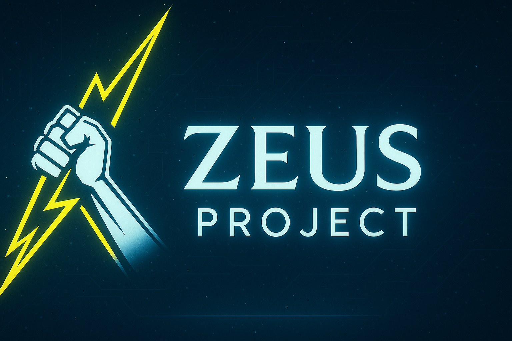

# Zeus Project

**Le second cerveau moderne pour l'organisation, la gestion de projets et la prise de notes intelligente.**



---

## 🚀 Présentation

Zeus est une plateforme SaaS tout-en-un pensée pour les étudiants, professionnels, créatifs et équipes qui veulent organiser leurs idées, projets, notes et ressources de façon visuelle, collaborative et sécurisée.

- **Gestion de projets et tâches avancée**
- **Prise de notes markdown avec éditeur immersif**
- **Graphes interactifs pour visualiser vos liens et dossiers (inspiré d'Obsidian)**
- **Partage et collaboration en temps réel**
- **Catégorisation, tags, recherche intelligente**
- **Sécurité et chiffrement des données**
- **Interface moderne, responsive et agréable**

---

## 🖥️ Fonctionnalités principales

- Création et organisation de dossiers, notes, tâches, projets
- Gestion des catégories, tags, couleurs personnalisées
- Partage de ressources avec gestion fine des droits
- Recherche rapide et filtrage intelligent
- Visualisation graphique dynamique (D3.js)
- Notifications, rappels, intégration Google Calendar
- Interface mobile-friendly et dark mode
- API et intégrations à venir

---

## 📸 Aperçu

| Dashboard Zeus | Graphe de notes | Éditeur markdown |
|:--------------:|:---------------:|:----------------:|
|  |  |  |

---

## ⚡ Installation rapide

1. **Clonez le dépôt :**
   ```bash
   git clone https://github.com/ArtilleryJuggernot/Zeus.git
   cd Zeus
   ```
2. **Installez les dépendances :**
   ```bash
   composer install
   npm install
   npm run build
   ```
3. **Configurez votre `.env` (copiez `.env.example`) et générez la clé d'application :**
   ```bash
   cp .env.example .env
   php artisan key:generate
   ```
4. **Lancez le serveur :**
   ```bash
   php artisan migrate --seed
   php artisan serve
   ```
5. **Accédez à l'application sur** [http://localhost:8000](http://localhost:8000)

---

## 💡 Use cases

- Prise de notes avancée (étudiants, chercheurs, créatifs)
- Gestion de projets (individuel ou en équipe)
- Organisation de ressources, fichiers, tâches, idées
- Visualisation des liens entre notes et dossiers (graphes)
- Collaboration et partage sécurisé

---

## 🛡️ Sécurité

- Chiffrement des notes et des données sensibles
- Gestion fine des droits d'accès et de partage
- Authentification sécurisée

---

## 👤 Auteur

<div align="center">
  
  <br>
  <b>Hugo Jacquel</b>  
  <br>
  <a href="https://www.linkedin.com/in/hugo-jacquel/" target="_blank">LinkedIn</a> · <a href="mailto:hugo.jacquel.pro@gmail.com">hugo.jacquel.pro@gmail.com</a>
</div>

Développeur fullstack passionné, créateur de Zeus Project.  
J'aime concevoir des outils qui rendent l'organisation, la créativité et la collaboration plus simples et plus agréables.  
Mon objectif avec Zeus : offrir une expérience moderne, puissante et accessible à tous pour gérer ses idées, ses projets et ses connaissances.

---

## 📄 Licence

Ce projet est open-source sous licence MIT.

---

## ⭐️ Un projet qui vous plaît  
N'hésitez pas à mettre une ⭐️ sur le repo, à contribuer ou à partager Zeus autour de vous !
